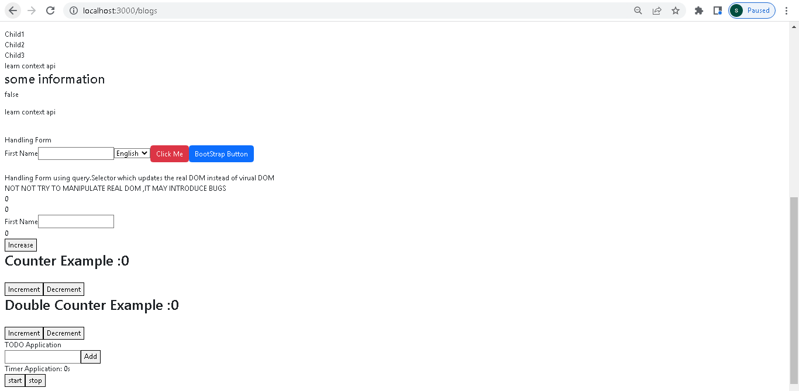

This is collections of  react application covering all topics, which covers tic tac toe, 
counter,Timer,Todo,ReverseCounter,styling in css,context alternative to prop  
drilling,reactstrap,Form handling which uses  
useState,useEffect,Routes,useRef,createRef,Context,Provider,Consumer  
